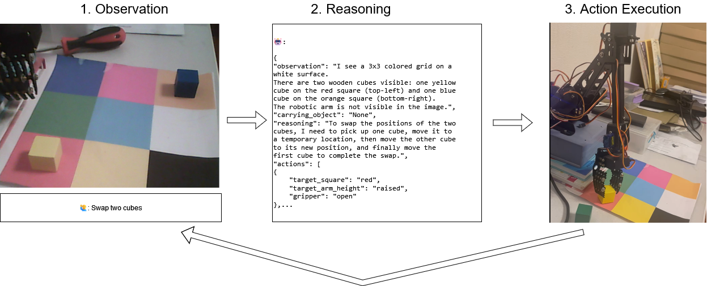

# Robot Control System

A Python-based system for controlling a robot with voice commands, computer vision, and natural language processing capabilities.

While this code is highly customized for a specific setup, it may serve as inspiration or provide reusable components for others working on similar projects.



## Features

- 🎤 Speech-to-Text (STT): Powered by OpenAI's API.
- 🔊 Text-to-Speech (TTS): Also powered by OpenAI's API.
- 👁️ Computer Vision: Integrated webcam support for visual input.
- 🤖 Servo Motor Control: Enables precise robotic arm movements.
- 🧠 AI-Powered Interaction: Leveraging the Claude Vision-LLM model for intelligent responses.

## Demo

[](https://youtu.be/1x7AYy6SPoE)

[Download the video](https://github.com/orzhan/robotic-arm-gpt/releases/download/v0-video/robot-3-demos-low.mp4)

Please enable sound to hear the instructions and the robot's reasoning.

## Prerequisites

- Python 3.9 or higher
- Webcam
- Microphone
- Speaker
- Robotic arm


## Usage

1. Set up your robotic arm and connect a webcam.

1. Calibrate the arm and implement the robot.py module, ensuring it defines the function:

```
execute_string_command(target_arm_position, target_arm_height, gripper)
```

1. Add your OpenAI and Anthropic API keys.

1. Launch the system using main.py to begin interacting with the robotic arm.

## Project Structure

```
robot-control/
├── main.py           # Main application entry point
├── robot.py          # Robot control and servo functions
├── stt.py           # Speech-to-Text processing
├── tts.py           # Text-to-Speech processing
├── webcamera.py     # Camera handling
├── util.py          # Utility functions
└── requirements.txt  # Project dependencies
```


## License

This project is licensed under the MIT License.